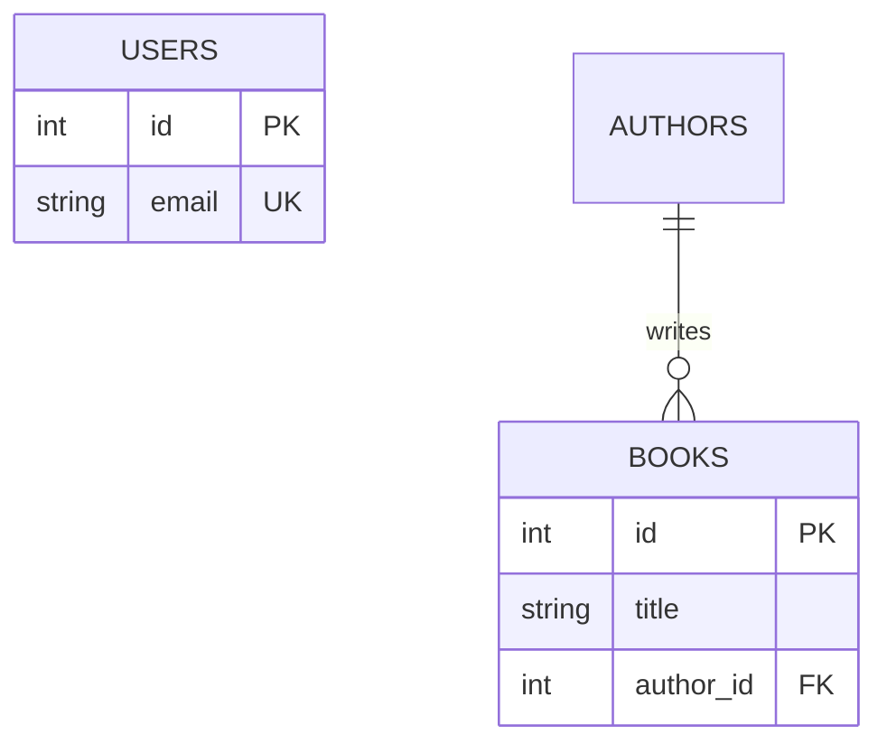

# ERD Generator

Turn a plain-English domain description into a **validated** Mermaid `erDiagram` and a rendered SVG.
Never present Mermaid code to the user that has not compiled successfully.

## Workflow

### 1. Parse the requirements
Extract from the user's description:
- **Entities** (nouns that need to be stored).
- **Attributes** for each entity, with a simple type.
- **Primary keys (PK)** and **foreign keys (FK)**.
- **Cardinalities** between entities (one-to-one, one-to-many, many-to-many).
- **Business decisions** the user stated (e.g. "a book can have many authors", "a loan belongs to exactly one borrower"). Where the prompt is ambiguous, pick the most reasonable option and record it as an assumption.

**Existing schema:** read `src/db/migrations/` before drafting. Any table that already exists (e.g. `users`) must appear in the diagram as an entity with its real columns, and new entities must reference it via FK rather than redefine it. Do not invent a second copy of an existing table.

### 2. Write the Mermaid file
Write the diagram to `docs/architecture/schema.mmd` (create `docs/architecture/` if missing). The file must start with `erDiagram`.

### 3. Validate and render
From the repository root, run:

```bash
node .agent/skills/erd-generator/scripts/render_erd.js docs/architecture/schema.mmd
```

- Output `SUCCESS` (exit 0) means `docs/architecture/erd.svg` was created.
- Output beginning with `SYNTAX_ERROR:` (exit 1) means compilation failed.

### 4. Self-correction loop
If the script prints `SYNTAX_ERROR:`:
1. Read the error trace (it usually names the offending line or token).
2. Fix the Mermaid in `docs/architecture/schema.mmd` (see the syntax rules below).
3. Re-run the script.
4. Retry **at most 3 times**. If it still fails, stop and report the last error and the current file contents to the user instead of claiming success.

### 5. Final output
Respond with:
1. The final raw Mermaid code in a ```mermaid code block (exactly what is in `schema.mmd`).
2. The rendered image path: `docs/architecture/erd.svg`.
3. A short bullet list of any business assumptions you made.

## Mermaid erDiagram syntax rules

Entities and attributes:



- Entity names: `UPPER_SNAKE_CASE`, no spaces, no hyphens, not starting with a digit.
- Attribute line format: `<type> <name> [PK|FK|UK]` and an optional quoted comment at the end. Type comes **first**, then name.
- Types must be a single word with no parentheses or commas: `int`, `string`, `text`, `boolean`, `date`, `timestamp`, `decimal`. Never write `varchar(255)`.
- Keys: only `PK`, `FK`, `UK` are valid. Multiple keys on one attribute are comma-separated (`PK, FK`).
- Relationship line: `ENTITY_A <left-cardinality>--<right-cardinality> ENTITY_B : "label"`. The label is required; wrap it in double quotes.
- Cardinality symbols: `||` exactly one, `|o` zero or one, `}o` zero or many, `}|` one or many. Examples: `||--o{` one-to-many, `||--o|` one-to-one.
- Use `--` for identifying relationships and `..` for non-identifying ones.
- Many-to-many relationships must be modeled with an explicit junction entity (e.g. `BOOK_AUTHORS`) containing two FKs, each joined by a one-to-many relationship.
- Every FK attribute must correspond to a relationship line, and every entity needs a `PK`.
- Don't use reserved or special characters in comments or labels (no unescaped quotes, braces, or semicolons).

## Common compile errors and fixes

| Symptom | Likely cause | Fix |
| --- | --- | --- |
| Parse error near an attribute | Name before type, or `varchar(255)` | Use `string name`, not `name string` or `varchar(255)` |
| Parse error on a relationship | Missing label or unquoted label | Add `: "label"` |
| `Expecting ... got ...` on entity name | Spaces/hyphens in entity name | Use `BOOK_AUTHORS` |
| Diagram missing | File doesn't start with `erDiagram` | Add it as the first line |
| Browser/puppeteer launch error | Environment issue, not syntax | Report to the user rather than rewriting the diagram |